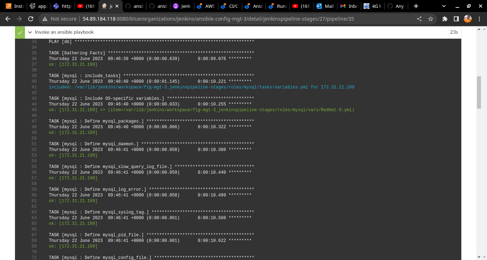
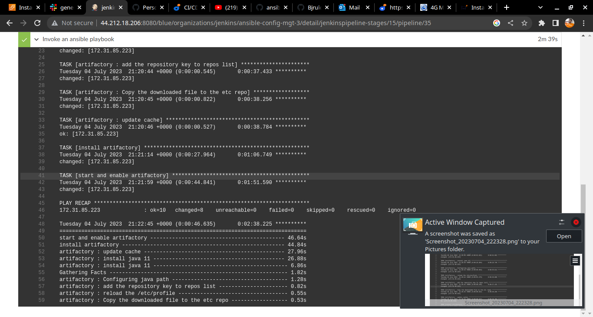
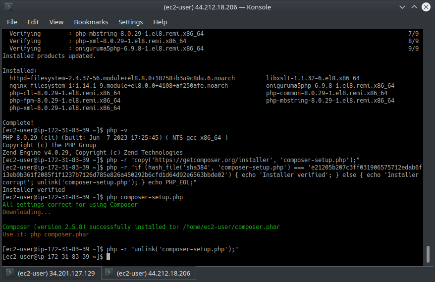
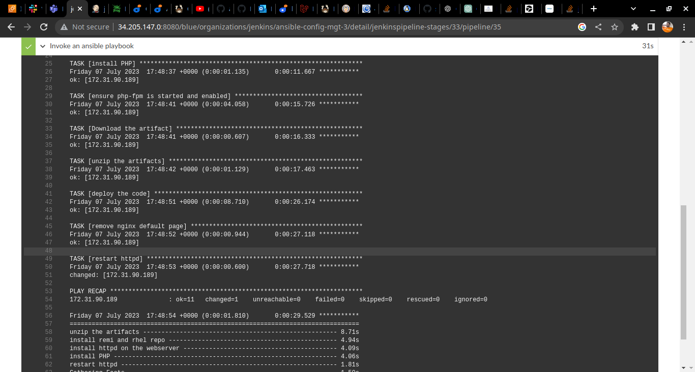
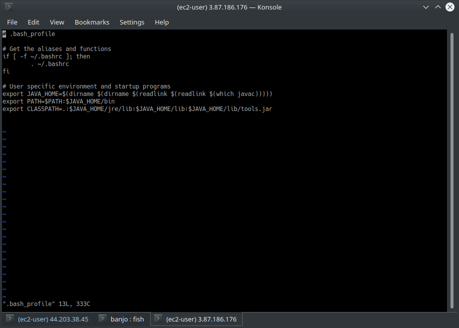

A flagship and Capstone Project so far.
**Set up a Jenkins Ansible server**
**Ensure to use jenkins t3.medium in aws because  t2.micro will become slow after installing Absible and other software on the machine**

[How to install Jenkins on Linux (ubuntu or RHEL or debian)](https://www.jenkins.io/doc/book/installing/linux/)

[Install ansible](https://docs.ansible.com/ansible/latest/installation_guide/intro_installation.html#installing-and-upgrading-ansible)

[Title](README-2.md)   

**Install Blue Ocean plugins in jenkins**
*Then install tghe following Plugins in jenkins: *Plot, Ansible, Blue Ocean , SonarQube Scanner*

[Title](README-2.md)  
 
 
 
 

**Updating the jenkins file with pipeline script**

 

**Install and configure Ansible Plugin in jenkins**

 
 
 
 
 
 
 

**Using 'ansible-galaxy collection install Role-name' to install Ngnix Webserver and MySQL Database**

 
 

*I had to add Sonarqube role and Artifactory role to my repository at this point and configure it as well*

*after modifying jenkins file to include the ${WORKSPACE} and ${inventory} variables, I can now 'build with parameters'*

** cloning the github repository php-todo which was forked from Darey so as to use it in VScode
 

### Installation of Plot and Artifactory plugin
 

**Installing artifactory roles using 'ansible-galaxy collection install jfrog.platform' and copying it to roles directory of my ansible-config-mgt-3*
 
 

 
 

*login and creating repository key in artifactroy after creating an inbound TCP rule on port 8082*
 
 
 
 

### configure Artifactory in jenkins
 
 

*Installing MySQL database to create User and Database 'homestead' using ansible role*
 
 
 
 
 
 
 

### at this point my jenkins initial jenkins cannot use the t2.micro free-tier so I started afresh but this time with RHEL8 t3.medium and I install php on it **Note that php 7.4 is the compatible and stable version for this project**
 *please do not install version8.* for the sake of this project*
 *installed php7.4 and composer*
*at this point I added the git cloned php-todo to my workspace and created a jenkins file in it* 
### create another pipeline job in jenkins for the php-todo application

 *if the 'php artisan migrate' throws an error then check the /etc/my.cnf file and set the bind address to 0.0.0.0 also check the .env.sample files(in the php-todo Directory) for sql login config settings(not forgetting to set inbound rule of port 3306 on EC2)*

### install mysql client in the jenkins server and test connection with the login particulars

*I had to comment the first three lines in the 'Prepare Dependencies' stage because I had performed them on my terminal*

### while installing phpunit, mfor the purpose of this project make sure it is phpunit version 6.* for compatibility sake , also remember that it is phpunit that installed phploc automatically (NB: phpunit is the tool used to perform unit test)

 
 

 
 
 
 

 
 
 
 

**Installation of Httpd, php, and Downloading and unziping Artifact from Repository 'firstkey' to TODO server*
 
 
 
 
 
 

*app deployed to Todo server successfully*

*spin up an EC2 use the sonarqube role in Ansible to set it up in jenkins
 
 
 
 

 
 
 
 

 

### EXTRA INFO: this very screenshot explains how you can have different version of java(jdk) installed while you can choose any as default for your system
 

###copy and paste this in the slaves 

*sudo vi ./bash_profile*

*export JAVA_HOME=$(dirname $(dirname $(readlink $(readlink $(which javac))))) 
export PATH=$PATH:$JAVA_HOME/bin 
export CLASSPATH=.:$JAVA_HOME/jre/lib:$JAVA_HOME/lib:$JAVA_HOME/lib/tools.jar*

### Reload 
*source ~/.bash_profile*

 
 
 
 

